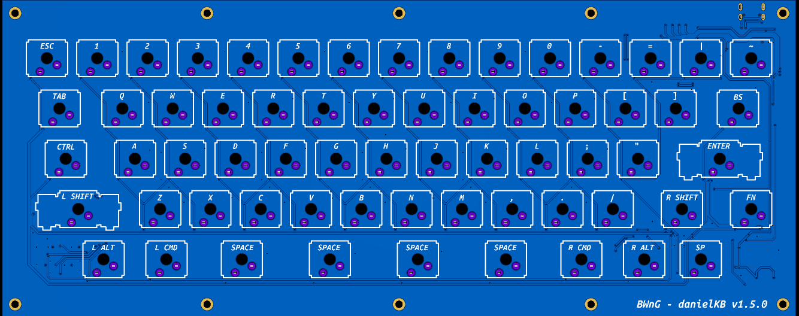
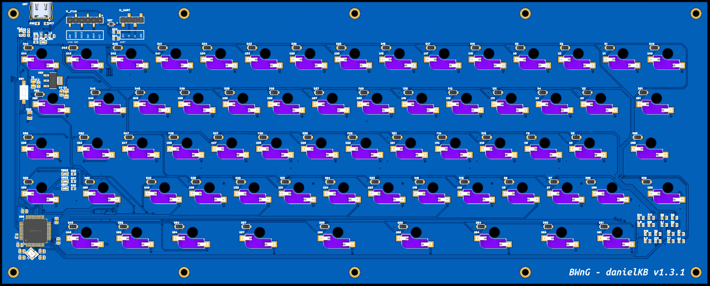
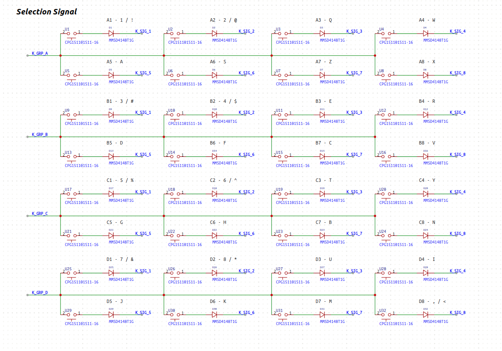
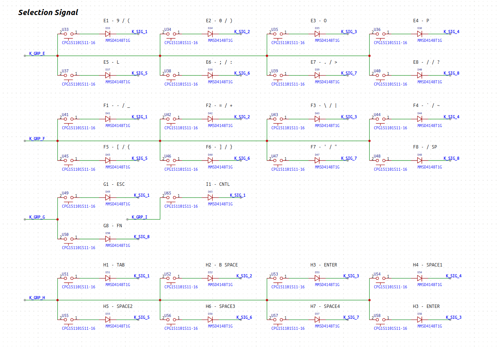
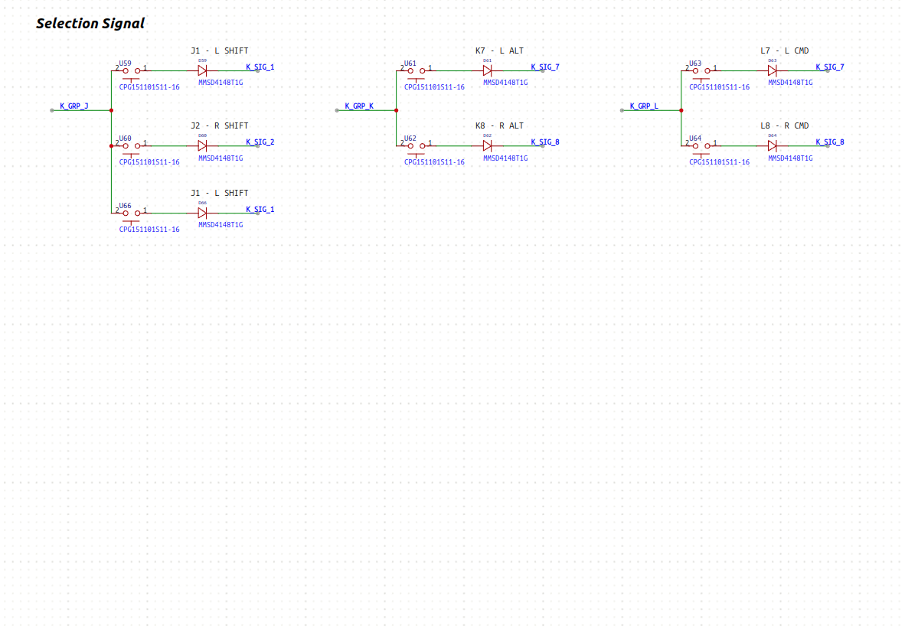
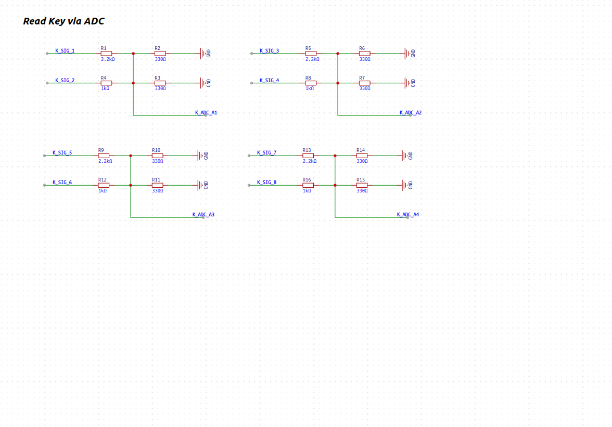
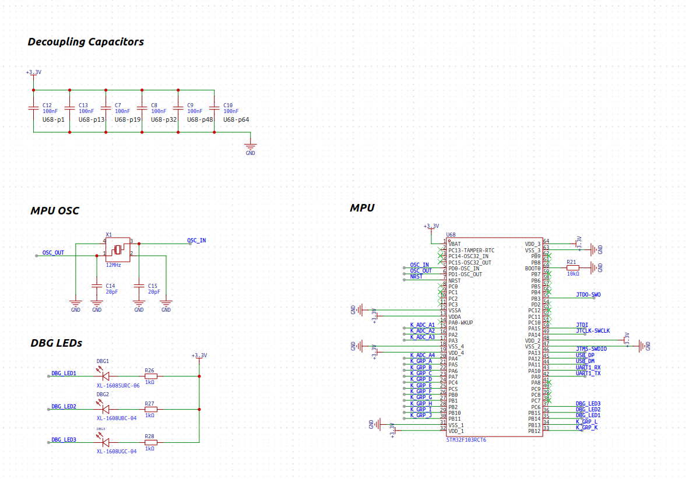
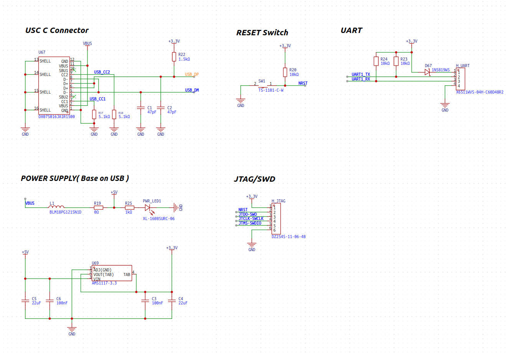

# danielKB
This is a keyboard I made for myself. Since I like the HHKB Style, I have made some modifications based on HHKB Layout.

## Dev. Info
- MPU : STM32F103RCT6
- IDE : STM32CubeIDE
- ECAD : EasyEDA Pro
- PCB and PCBA were manufactured through JLCPCB( [jlcpcb.com](https://jlcpcb.com/) )

## Version

- Hardware : v 1.4.0
- Firmware : v 1.1     

## Issue
 - Currently, Volume Up/Down and Mute key is not operated.
   
   
   
   

## PCB Layout

   

## Schematic

### Schematic 1 - selection signal - part 1

### Schematic 2 - selection signal - part 2

### Schematic 3 - selection signal - part 3

### Schematic 4 - selection signal - part 4

### Schematic 5 - main

### Schematic 6 - power / swd

