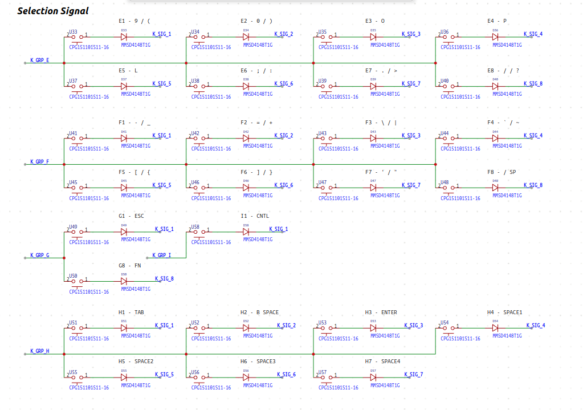
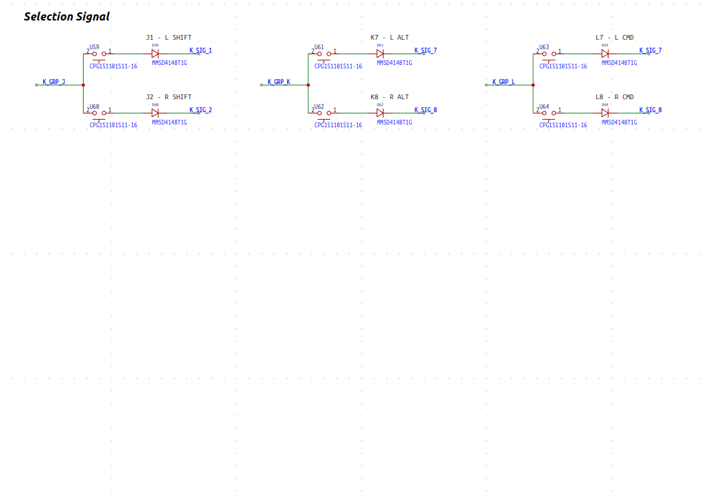
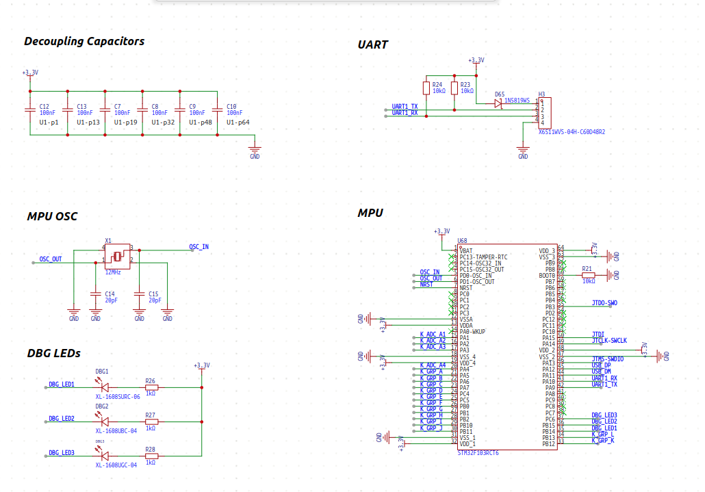

## Schematic

### Schematic 1 - selection signal - part 1

### Schematic 2 - selection signal - part 2

### Schematic 3 - selection signal - part 3

### Schematic 4 - selection signal - part 4

### Schematic 5 - main

### Schematic 6 - power / swd

